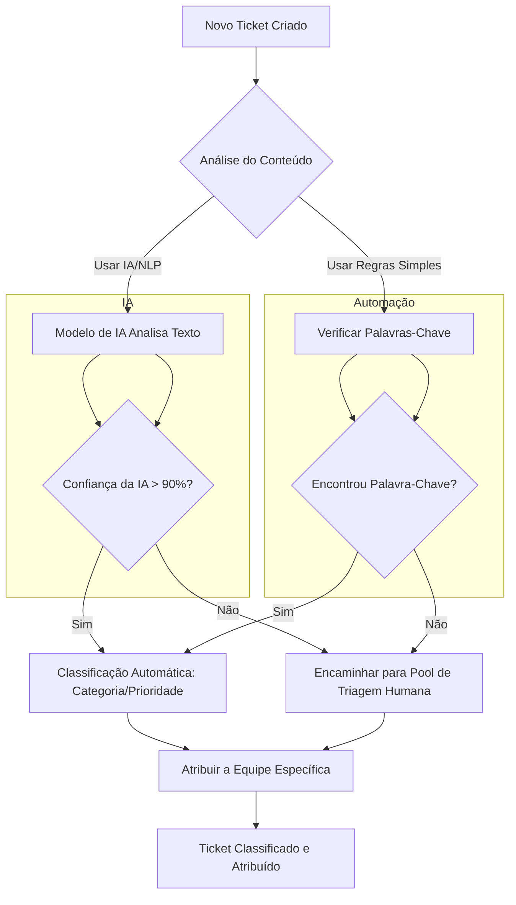

# Galactus-Gateway
Seus tickets encontram sua órbita perfeita!
## Mermaid

## Explicação do Diagrama:
 - Novo Ticket Criado: Início do fluxo quando um ticket é aberto.
 - Análise do Conteúdo: Decisão entre usar IA (NLP) ou regras baseadas em palavras-chave.
 - Modelo de IA (Subfluxo IA):
    - Classifica o ticket com base na análise de texto.
    - Se a confiança for alta, prossegue; caso contrário, vai para triagem humana.
- Regras Simples (Subfluxo Automação):
    - Verifica palavras pré-definidas (ex.: "erro", "pagamento").
- Validação Humana: Tickets ambíguos são revisados manualmente.
- Finalização: Ticket é direcionado à equipe responsável.
